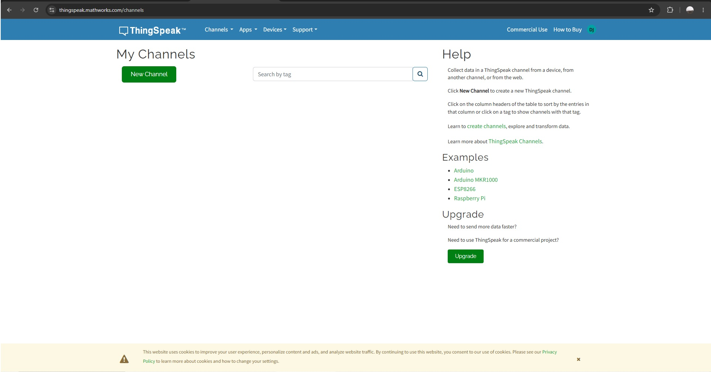
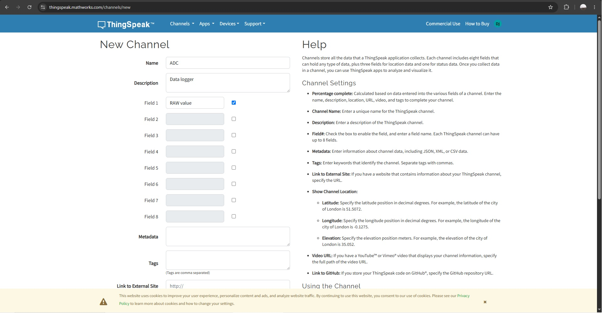
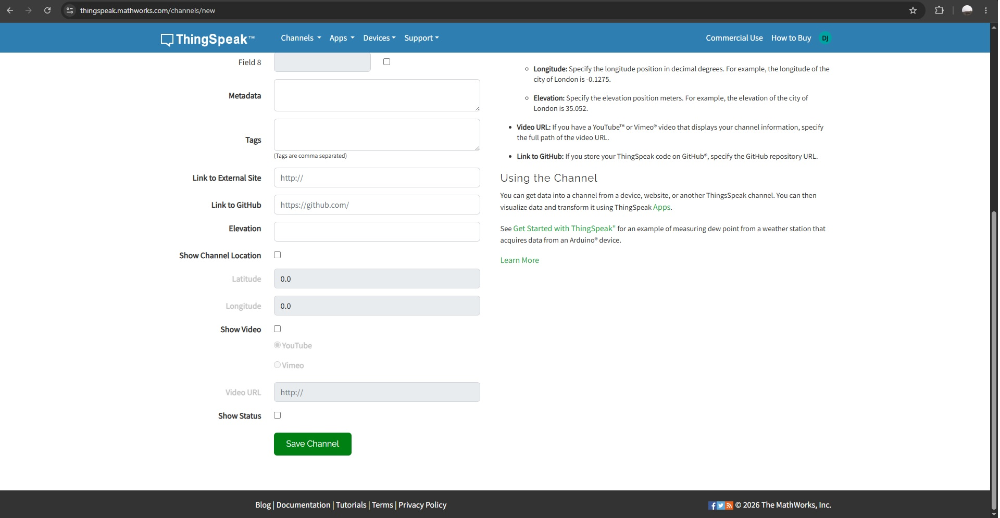

# EasyIoT Student Manual

EasyIoT lets an ESP32 send one value from your Arduino program to **ThingSpeak Field 1**. You write your usual sensor or calculation code; EasyIoT handles Wi-Fi, reconnection, the cloud request, and upload timing.

> EasyIoT is a cloud transport helper, not a sensor library. It does not read sensors for you.

## What you will do

1. Create a ThingSpeak channel with **Field 1** enabled.
2. Copy the channel's **Write API Key**.
3. Add your Wi-Fi details and Write API Key to the example.
4. Upload the sketch to an ESP32.
5. Open the ThingSpeak channel to see the Field 1 chart.

## What you need

- An ESP32 development board and USB cable
- Arduino IDE with ESP32 board support installed
- A Wi-Fi network with internet access
- A ThingSpeak account

## Part 1: Create a ThingSpeak channel

1. Sign in at [ThingSpeak](https://thingspeak.com/). On the **My Channels** page, select **New Channel**.

   

2. Enter a channel name. For example, use `ADC` for an analog-value experiment.
3. Tick the box beside **Field 1**. Give it a useful name such as `RAW value`, `Temperature`, `Distance`, or `Light`.
4. Leave Fields 2–8 unticked for this EasyIoT example. EasyIoT sends only to **Field 1**.

   

5. Scroll to the bottom and select **Save Channel**.

   

After saving, ThingSpeak opens your channel's **Private View**. It contains the Field 1 chart. The chart is empty until your ESP32 sends data.

## Part 2: Copy the Write API Key

1. On your channel page, select the **API Keys** tab.
2. Copy the **Write API Key**.
3. Keep this key private. Anybody with it can add data to your channel.

You do **not** need the Channel ID for EasyIoT.

## Part 3: Open the EasyIoT sketch

The `BasicThingSpeak` folder already contains both required files:

```text
BasicThingSpeak/
├── BasicThingSpeak.ino
└── EasyIoT.h
```

1. Download or copy the complete `BasicThingSpeak` folder.
2. Keep both files together in that folder.
3. Open `BasicThingSpeak.ino` in Arduino IDE.

Arduino will show `EasyIoT.h` as another tab. The sketch includes it with:

```cpp
#include "EasyIoT.h"
```

## Part 4: Set your Wi-Fi and ThingSpeak details

Open `BasicThingSpeak/BasicThingSpeak.ino` and replace only the text inside these quotation marks:

```cpp
#define WIFI_SSID "YOUR_WIFI_NAME"
#define WIFI_PASSWORD "YOUR_WIFI_PASSWORD"
#define THINGSPEAK_KEY "YOUR_THINGSPEAK_WRITE_API_KEY"
```

For example, `WIFI_SSID` is the name shown when you connect a phone or computer to your Wi-Fi network. Do not commit or share a sketch containing your real password or Write API Key.

## Part 5: Upload the example

1. Connect the ESP32 with a USB cable.
2. In Arduino IDE, select your board. For a common ESP32 board, choose **ESP32 Dev Module**.
3. Select the correct port.
4. Upload `BasicThingSpeak.ino`.
5. Open **Serial Monitor** and set the speed to **115200 baud**.

The example reads the analog pin GPIO 34:

```cpp
int data = analogRead(34);
```

This is only an example. An unconnected analog pin may show changing or zero values. You can replace this line with your own sensor code later.

## The two EasyIoT commands

### Start IoT once

Put this in `setup()` after `Serial.begin(115200)`:

```cpp
IOT_BEGIN(WIFI_SSID, WIFI_PASSWORD, THINGSPEAK_KEY);
```

This starts the ESP32 Wi-Fi connection and remembers the details needed for later reconnection and uploads.

### Send one value to the cloud

Put this in `loop()` after you have calculated or read a value:

```cpp
Serial.println(data);  // Send/display data on the computer.
SEND_IOT(data);        // Send the same value to ThingSpeak Field 1.
```

`Serial.println(data)` helps you check the value on your computer. `SEND_IOT(data)` sends that value to ThingSpeak. This is the main idea of EasyIoT.

## Upload timing

You may call `SEND_IOT(data)` every time through `loop()`. The current EasyIoT header automatically allows one upload every **20 seconds**, so your sensor code and Serial Monitor can continue to run quickly.

ThingSpeak can reject data sent too frequently. If the Serial Monitor says that ThingSpeak rejected the data, wait for the next 20-second upload and check that you copied the Write API Key correctly.

## See your data in ThingSpeak

Return to the channel's **Private View**. Each successful upload creates one entry and adds a point to the **Field 1 Chart**. The Serial Monitor prints an entry number after a successful upload.

If the graph shows `0`, that is the value your ESP32 sent. Check your sensor wiring and the value printed in Serial Monitor before changing EasyIoT.

## Send any normal Arduino variable

EasyIoT can send common numeric values from analog input, I2C, SPI, UART, calculations, or normal variables.

```cpp
SEND_IOT(temperature);
SEND_IOT(distance);
SEND_IOT(light);
SEND_IOT(data);
```

Normally use only **one** of these in a sketch, because all of them send to the same destination: ThingSpeak **Field 1**.

## Troubleshooting

| Serial Monitor message | What to check |
| --- | --- |
| `WiFi connection failed.` | Check `WIFI_SSID`, `WIFI_PASSWORD`, Wi-Fi range, and internet access. |
| `WiFi disconnected. Reconnecting...` | Wait for reconnection; check the Wi-Fi network if it continues. |
| `ThingSpeak rejected the data.` | Check the Write API Key and wait for the 20-second interval. |
| `Connection Error` | Check Wi-Fi internet access and try again. |
| Chart has no entries | Confirm Field 1 is enabled, the correct Write API Key is used, and the Serial Monitor reports a successful entry number. |

## Keep your own sensor code

Do not put sensor libraries, pin setup, or sensor-reading code inside `EasyIoT.h`. Keep your existing sensor program and add only:

```cpp
#include "EasyIoT.h"
IOT_BEGIN(WIFI_SSID, WIFI_PASSWORD, THINGSPEAK_KEY);
SEND_IOT(yourValue);
```
